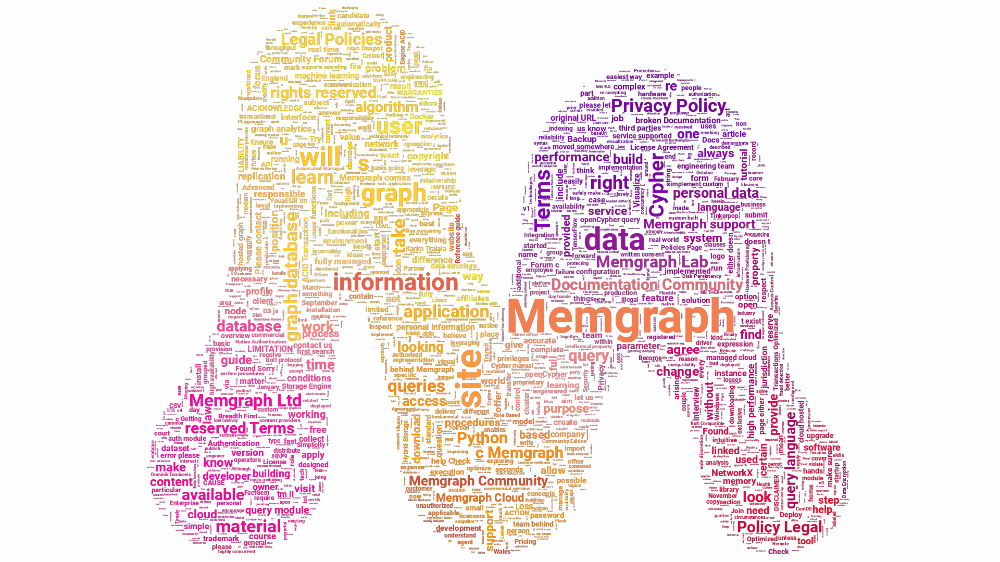
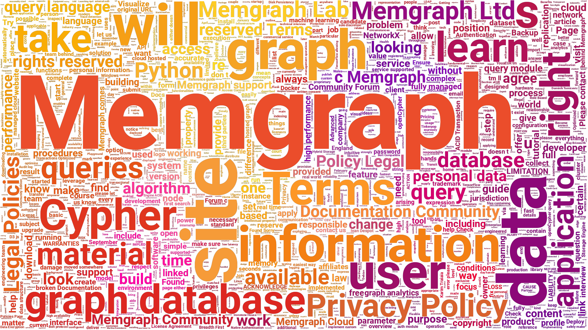
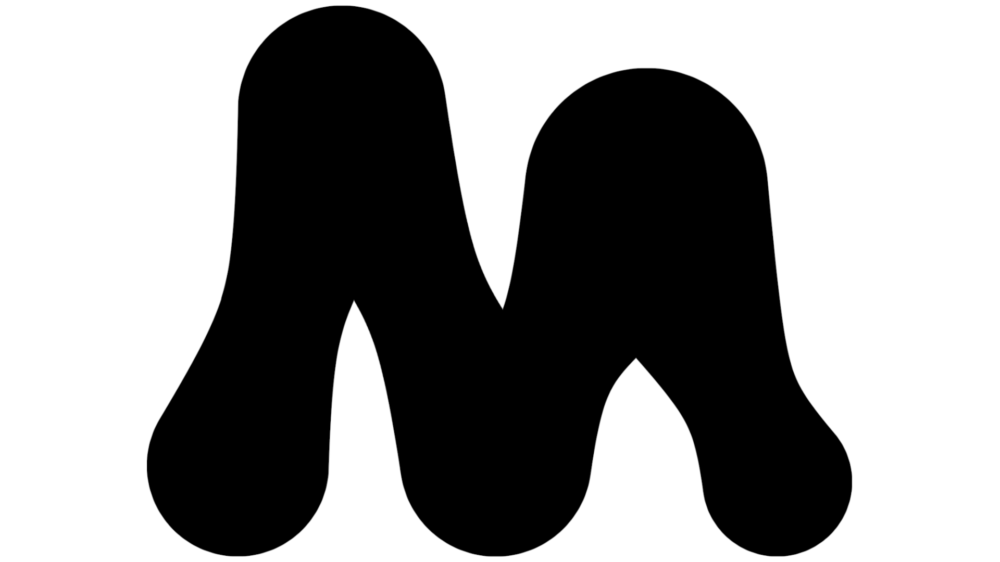
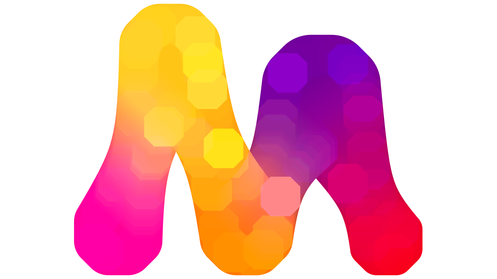
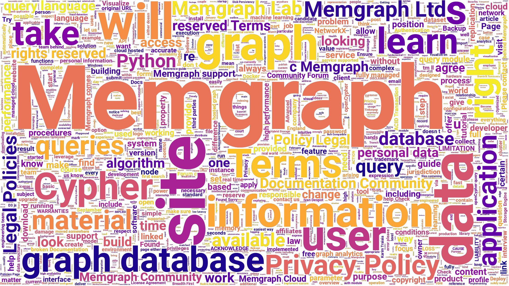
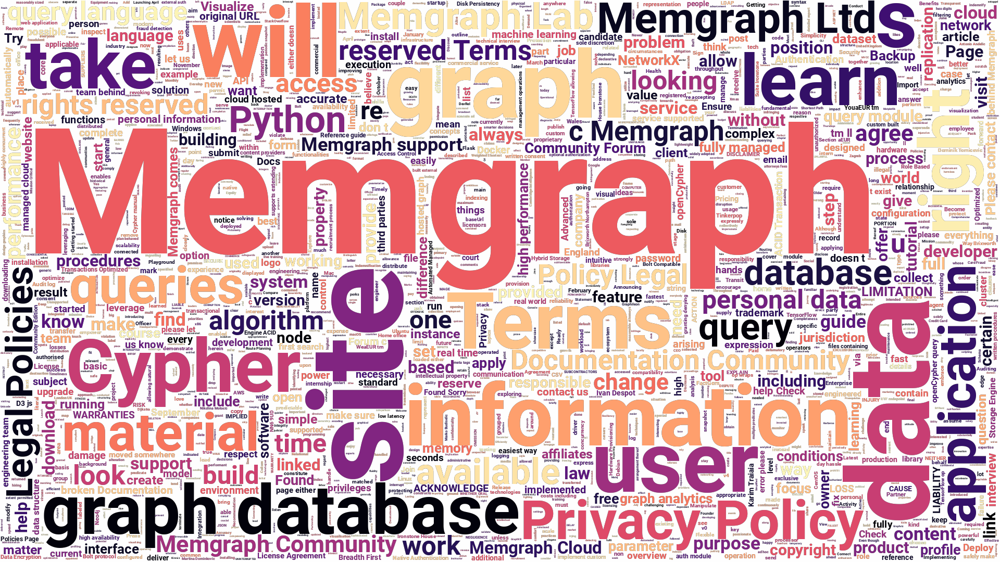
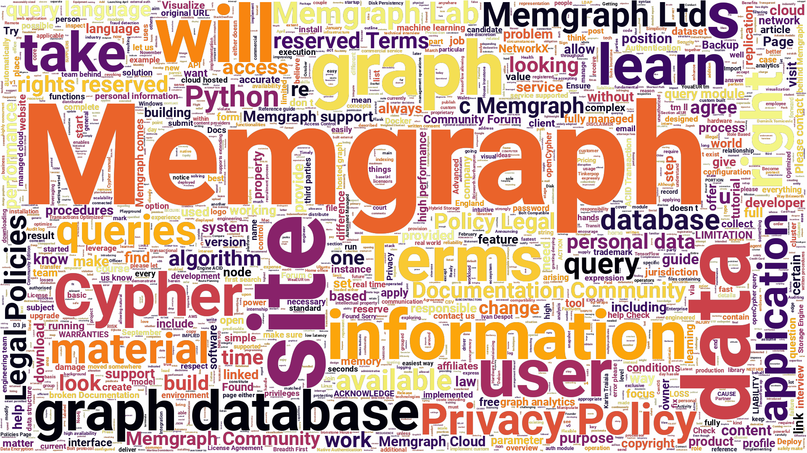

# creating a gradient word cloud

gradient on gradient | white on gradient
:-------------------------:|:-------------------------:
 | 

masked image colour generator | masked custom colouring
:-------------------------:|:-------------------------:
 | 

## generating words
In theory we would like to choose a domain and get all relevant words from it.
One way to do it is to [scrape](https://en.wikipedia.org/wiki/Web_scraping) all text from heading and paragraph tags.
We can do that using python and [beautiful soup](https://pypi.org/project/beautifulsoup4/).
If we did that synchronously it could take an hour or more, depending on the domain size.
For that reason we can do it using the python `asyncio` package.
This way the bottleneck becomes the internet speed and the maximum number of open files.
On a Linux system that is usually 1024.
For the task queue and the memory set we can use [redis](https://redis.io/) alongside the asynchronous [aioredis](https://github.com/aio-libs/aioredis-py) package.
Check out the implementation in `scraper.py`.

## creating a mask
black & white | colourful
:-------------------------:|:-------------------------:
 | 
Create by fitting the logo to the center of the image with [gimp](https://www.gimp.org), selecting alpha to selection on the layer and growing it by a couple of pixels. | Create by fitting the logo to the center of the image with [gimp](https://www.gimp.org) and then [dilate](https://legacy.imagemagick.org/Usage/morphology/#dilate) it with [imagemagick](https://imagemagick.org).

## colourize
Simplest way to colour the word cloud is using one of the predefined [matplotlib colormaps](https://matplotlib.org/stable/tutorials/colors/colormaps.html).
A step up would be to use the colourful mask we created.
The best option is to colour the text transparent and edit the rest in [gimp](https://www.gimp.org).
colormap plasma | colormap magma
:-------------------------:|:-------------------------:
 | 

colormap inferno | mask colouring
:-------------------------:|:-------------------------:
 | 

custom colouring | custom colouring
:-------------------------:|:-------------------------:
 | 
